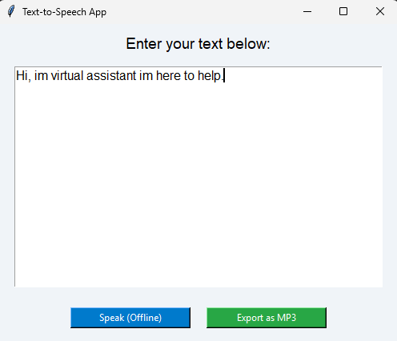

# Text-to-Speech Tkinter

A simple Python-based Text-to-Speech app using Tkinter GUI and gTTS/pyttsx3.



## Features

- 🗣️ Offline speech with pyttsx3
- 🎙️ MP3 export using Google gTTS
- 🖥️ Simple and clean Tkinter GUI
- 🚫 No freezing — with multithreading

## How to Run

```bash
pip install gTTS pyttsx3
python app.py
